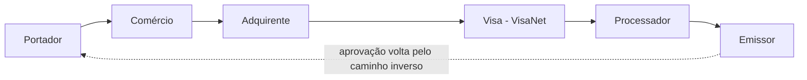

# 2. Fundamentos de pagamentos

## [[Modelo de quatro partes]]
A transação é uma **mensagem com vários campos** (padrão [[ISO 8583]]: `0100` requisição, `0110` resposta) que percorre um caminho e volta.

- **Portador:** cliente, dono do cartão.
- **Comércio:** quem vende (loja ou e-commerce).
- **[[Adquirente]]:** banco do comércio; captura a transação e a envia à rede.
- **Visa / [[VisaNet]]:** a rede que transporta, checa fraude e roteia.
- **[[Processador]]:** interpreta a mensagem; no crédito pode aprovar em nome do emissor.
- **[[Emissor]]:** banco que emitiu o cartão; confere saldo/fraude e aprova. A resposta volta pelo caminho inverso.

No débito, normalmente o **banco** aprova; no crédito, banco ou processador.

## Autorização não é movimento do dinheiro
Na autorização o dinheiro **não se move** — a compra já aparece no extrato, mas o comércio ainda não foi pago. O dinheiro anda em lotes:
- **[[Clearing]]:** troca e conciliação das informações das transações.
- **[[Settlement]]:** liquidação — quando o dinheiro efetivamente se move.

## [[Processador]] × adquirente × emissor
> [!info] Não confundir os papéis
> **[[Emissor]]** = banco do cliente (cartão, conta, saldo). **[[Adquirente]]** = banco do comércio. **[[Processador]]** = empresa técnica que opera as mensagens por conta de um emissor OU de um adquirente. [[Sistarbank]] (BROU) e [[Prisma]] (Corrientes) são processadores emissores. Adquirente e processador não são sinônimos, mas a mesma empresa pode fazer os dois papéis.

**Analogia do telefone:** emissor e adquirente são as duas pessoas conversando; a Visa é a operadora que conecta a chamada; o processador é o aparelho/central que cada uma usa para transmitir a voz — infraestrutura técnica, não um interlocutor.

## [[VisaNet]]
É a rede e a infraestrutura da Visa por onde passam os pagamentos — o "trilho" entre adquirente e emissor. É onde o [[CS Implementations]] faz as configurações (alta de BINs, troca de processador).

---
[[Home]]
