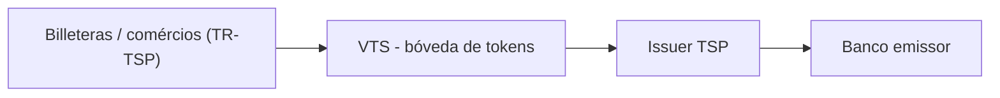

# 3. [[Tokenização]]

É o "verbo" mais usado: carteiras e [[Click to Pay]] são tokenização aplicada.

## O que é um token
Em vez do PAN (número real), guarda-se um **token**. Vocabulário:
- **[[FPAN]]** — número real do cartão (Funding PAN).
- **[[DPAN]]** — token no dispositivo (Apple/Google Pay).
- **[[MPAN]]** — token vinculado a um comércio (recorrência).
- **[[APAN]]** — token de conta derivado do [[DPAN]], para multi-comércio.

## Arquitetura ([[VTS (Visa Token Service)|VTS]], TSP / [[ITSP]])

A Visa oferece o **[[VTS (Visa Token Service)|VTS]]**; a maioria contrata um **TSP** (consoles, ciclo de vida dos tokens). Do lado do emissor é o **[[ITSP]]** (no Corrientes, a **[[Thales]]**).

## Fluxo de aprovisionamento e APIs do emissor
Enroll Device → Enroll PAN → [[Check Eligibility]] → [[Approve Provisioning]] → Provision Token → Token Created.

APIs do emissor: [[Check Eligibility]], [[Approve Provisioning]], [[Get CVM]], [[Send Passcode]], notificações (Token Created, Card Metadata / PAN Update), ciclo de vida (Token Inquiry, Token/PAN Lifecycle, Update Card Metadata) e Device Token Binding ([[CTF (Cloud Token Framework)|CTF]]).

## Fluxo verde × amarelo (o ponto que mais aparece)

| Aspecto | [[Fluxo verde (00)]] | [[Fluxo amarelo (85)]] |
|---|---|---|
| Decisão | Aprovação incondicional | Condicional (exige step-up) |
| Autenticação extra | Não precisa | Sim; token inativo até verificar |
| Como verifica | — | [[Get CVM]] → OTP ([[Send Passcode]]), call center, app-to-app |
| Quando ocorre | Enrolar de dentro do app do banco | Enrolar direto pela carteira |

## Ciclo de vida e [[CTF (Cloud Token Framework)|CTF]]
Ações (issuer host): ACTIVATE, DELETE/DEACTIVATE, SUSPEND, RESUME, UPDATE PAN EXPIRATION, UPDATE PAN-TOKEN MAPPING. **Update Card Metadata** atualiza a carátula do cartão (o [[VTS (Visa Token Service)|VTS]] notifica as carteiras). **[[CTF (Cloud Token Framework)]]** = device binding para tokens de e-commerce/CoF; **[[TAVV]]** = cryptograma enviado na transação do token.

> [!tip] Aprofundamento técnico
> Arquitetura VTS, as 8 APIs do emissor e o fluxo de provisioning passo a passo: [[Tokenização — arquitetura VTS e provisioning (aprofundamento)]].

---
[[Home]]
