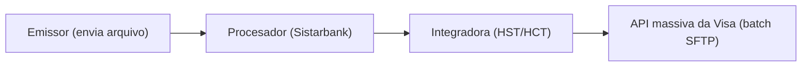

# [[Click to Pay]] — [[SRC - EMVCo|SRC]], enrolamento e ciclo de vida (aprofundamento)

Aprofunda [[5. Click to Pay]]. Baseado no padrão **[[SRC - EMVCo|EMVCo SRC]]** (fontes públicas) + a sessão técnica Visa·Emisor·Procesadora (fonte BROU).

## O padrão [[SRC - EMVCo|EMVCo]] SRC
[[Click to Pay]] é a marca de consumidor do **EMV Secure Remote Commerce ([[SRC - EMVCo|SRC]])**. A especificação tem quatro componentes: **Core Specification**, **API Specification**, **JS SDK Specification** e **UI Guidelines & Requirements** — dão uma base comum de enrolamento e ciclo de vida entre emissores e sistemas de pagamento.

**Enrolamento** = associar um **PAN** a um **[[SRC - EMVCo|SRC]] Profile** (novo ou existente). Pode ser evento avulso ou dentro do checkout.

## Participação do emissor
O emissor pode pedir ao seu **processador [[VisaNet]]** / scheme processor / **[[Third Party Agent]]** para enrolar e fazer o **lifecycle management** por ele — foi o que o [[BROU — dossiê|BROU]] fez via [[Sistarbank]] + [[HST - HCT|HST/HCT]].

## Fase 1 — [[Enrolamento massivo]] (pipeline técnico)

- Com **múltiplos perfis** (vários códigos emisores), é preciso **invocar as APIs uma vez por perfil** — cuidado com **[[External Consumer ID]]** redundante (o BROU tem 4 códigos emisores).
- Spec: **"BK Batch Specification"** no [[VDP (Visa Developer Platform)|VDP]] (pedir também o Swagger via [[HST - HCT|HST]]).

## Fase 2 — Ciclo de vida (sem [[TPM (Technical Project Manager)|TPM]])
Nos canais do emissor: **opt-out/desenrolamento**, **atualização** de dados e de cartões (renovação por vencimento, baixa por roubo) e **enrolamento individual** de cartões novos (fora do massivo). Não há contraparte técnica da Visa — investigar quem certifica.

## Checkout — autenticação
Login por **email OU telefone (OTP)** → o lookup lista **todas** as credenciais daquele contato (cross-emisor e cross-marca). Baixa fricção com **[[Passkey - App-to-App|Passkey / App-to-App]]**.

## Notificação de tentativa
API **"[[Click to Pay]] Enrollment Attempt Notification"** (VICA, POST): a Visa avisa o emissor quando alguém tenta se enrolar pelo **[[Destination Site]]** com o enrolamento do emissor já habilitado.

## Fontes oficiais (públicas)
- [EMV Secure Remote Commerce — emvco.com](https://www.emvco.com/emv-technologies/secure-remote-commerce/)
- [[[SRC - EMVCo|SRC]] / [[Click to Pay]] — emvco.com](https://www.emvco.com/emv-technologies/src/)
- [Visa [[Click to Pay]] / [[SRC - EMVCo|SRC]] — developer.visa.com](https://developer.visa.com/capabilities/visa-secure-remote-commerce/docs)

---
[[Home]]
