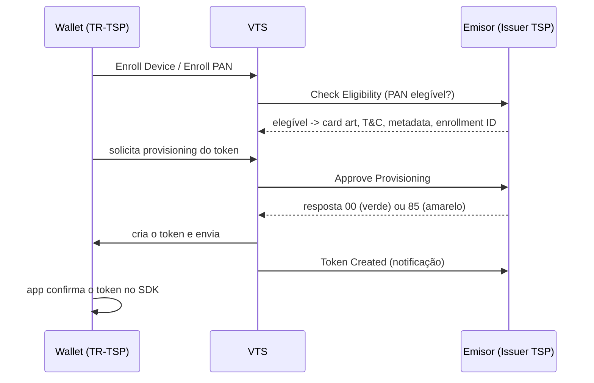

# [[Tokenização]] — arquitetura [[VTS (Visa Token Service)|VTS]] e provisioning (aprofundamento)

Aprofunda o conceito [[3. Tokenização]]. Baseado na **capacitação técnica da Visa** (fluxos de API lado emissor) + a norma **[[SRC - EMVCo|EMVCo]] Payment Tokenisation** (2014), que o [[VTS (Visa Token Service)|VTS]] implementa.

## Arquitetura [[VTS (Visa Token Service)|VTS]] — três papéis
O [[VTS (Visa Token Service)|VTS]] é a **plataforma/bóveda** que troca dados entre solicitantes de token e emissores.

| Papel | Quem | Função |
|---|---|---|
| **Token Requestor (TR-[[TSP (Token Service Provider)|TSP]])** | Carteiras (Apple/Google/Samsung/Garmin/Fitbit), comércios, e-comm/CoF | Solicita o token |
| **[[VTS (Visa Token Service)|VTS]]** | Visa | Bóveda/**geração de tokens**; processa transações de token (**destokenização** e controles de domínio) |
| **Issuer TSP** | [[ITSP]] do emissor | Serviços de token do lado do banco |

Cada um oferece: incorporação/gestão, aprovisionamento, ID&V, gestão do ciclo de vida e notificações. **Card Present** usa o **Secure Element (SE)**; **Card Not Present** usa **HCE / e-comm / CoF**.

## As 8 APIs do lado do emissor
1. **[[Check Eligibility]]** — o PAN é elegível para tokenizar?
2. **[[Approve Provisioning]]** — aprovar (00 [[Fluxo verde (00)|verde]] / 85 [[Fluxo amarelo (85)|amarelo]] / rejeitar).
3. **[[Get CVM]]** — métodos de verificação no step-up.
4. **[[Send Passcode]]** — OTP do step-up.
5. **Notifications** — Token Created, Card Metadata / PAN Update.
6. **Life Cycle Management** — ACTIVATE, SUSPEND, RESUME, DELETE, UPDATE PAN EXPIRATION.
7. **Device Token Binding** — [[CTF (Cloud Token Framework)|CTF]].
8. **Update Card Metadata** — atualiza a carátula (o [[VTS (Visa Token Service)|VTS]] notifica as carteiras).

## Fluxo de aprovisionamento (alto nível)

No amarelo (85) o token fica **inativo** até o step-up ([[Get CVM]] → [[Send Passcode]] / call center / app-to-app).

## [[OPC]] ([[Push - In-App Provisioning (fluxo verde)|In-App Provisioning]] API)
A API de [[Push - In-App Provisioning (fluxo verde)|In-App Provisioning]] usa um **[[OPC]] (Opaque Payment Card)** para o [[FPAN]] (número real, que pode ser guardado) e provisiona o [[DPAN]] (token) na carteira do dispositivo.

## Fontes oficiais (públicas)
- [[[VTS (Visa Token Service)|Visa Token Service]] — usa.visa.com](https://usa.visa.com/products/visa-token-service.html)
- [[[VTS (Visa Token Service)|VTS]] Provisioning & Credential Management — developer.visa.com](https://developer.visa.com/capabilities/token-service-provisioning)
- [Visa [[Push - In-App Provisioning (fluxo verde)|In-App Provisioning]] API ([[OPC]]/[[DPAN]]) — developer.visa.com](https://developer.visa.com/capabilities/visa-in-app-provisioning/docs)
- [EMV Payment Tokenisation — emvco.com](https://www.emvco.com/emv-technologies/payment-tokenisation/)
> A documentação detalhada do [[VTS (Visa Token Service)|VTS]] é de acesso restrito (produto restrito); as fontes acima são as páginas públicas.

---
[[Home]]
